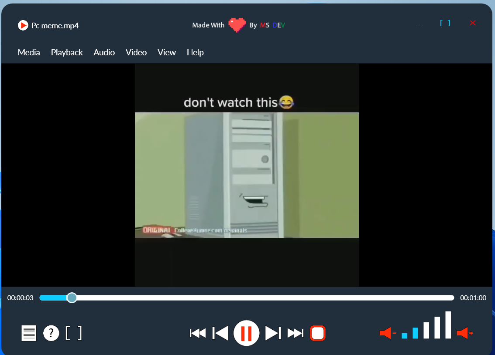
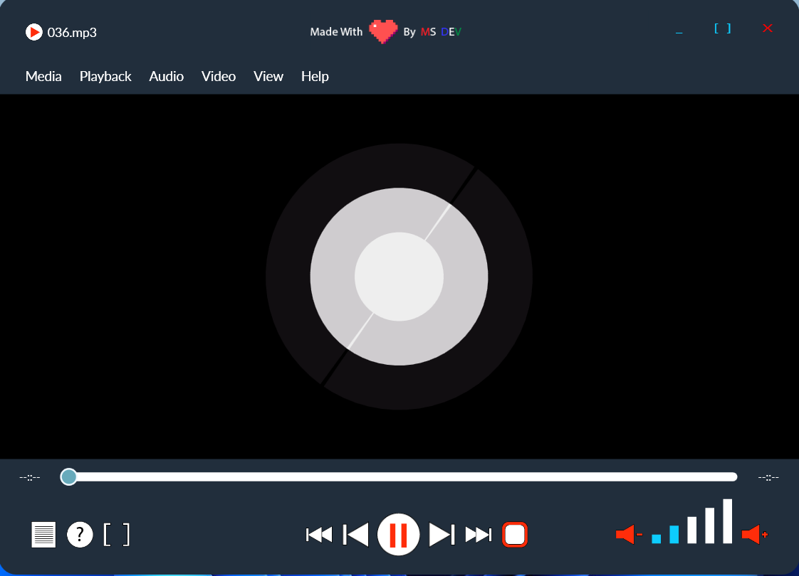

## WPF Media Player Application

## About 

The application is specifically designed to play media files. The media player supports the following media file types: .mp3, .mpg, .mpeg, .mp4, .ts, .mkv

## Prerequisites

The application only runs on a windows operating system. To run the source code, you need visual studio, c#, .net and wpf installed.

## App Features

- Audio Player
- Video Player
- Media file dialogs
- Playback control buttons
- Audio controls
- Media progress
- Error Dialog
- Warning Dialog
- About Dialog

## Technologies/Dependencies used

- C#
- .Net Framework
- WPF 
- Xaml
- MVVM Light
- Xunit
- Autofac 
- Fody Weavers 

## Development & Version Control

- Visual Studio (Development)
- Adobe XD (Mockup Design)
- Gitbash & Github (Version control)

## Screenshots

### Main window 

### Video Mode

### Audio Mode

## Contributors
Muhammed Suwaneh, Eskişehir Osmangazi University, 2022

## Version 
1.0.0

## Licenced 
Under [`MIT`](LICENSE) Copyright 2022  

